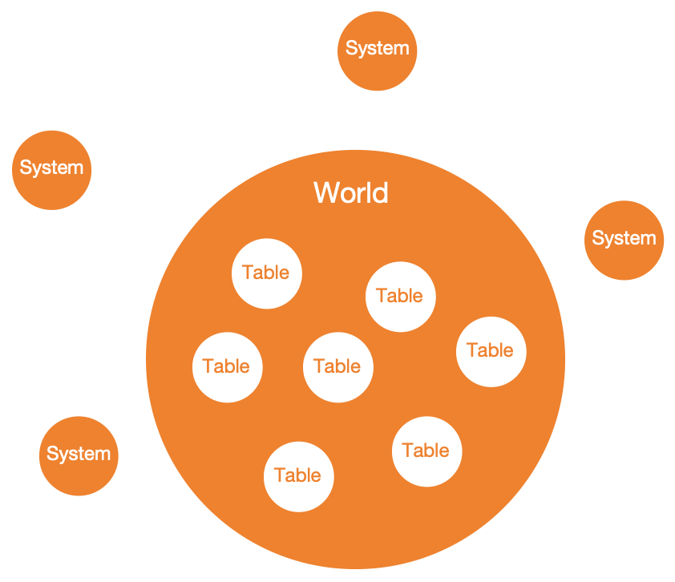

Autonomous World
===================

Every application built with Mud is an autonomous world. Essentially, an
autonomous world is a series of smart contracts organized under core storage
protocol and resource usage and management protocol, forming a structured
whole through various forms of contract interactions.

**Understanding the composition and operation of autonomous worlds is key to
flexibly using the Mud framework.**

Components
----------------

In the :ref:`Mud Framework Introduction <brief-introduction>`, we mentioned
that Mud, like Diamond, separates data from business logic.

For ease of understanding, let's assume we're implementing a standard ERC20
token project. With data and business logic separated, ``ERC20 Metadata``,
``balances``, and ``allowances`` are stored in one contract, while
methods like ``transfer`` and ``approve`` are implemented in other
contracts.

The above image vividly represents the composition of a basic autonomous world
built with Mud. Each orange circle represents a contract instance. The largest
one in the center is the main contract of the autonomous world, ``World``,
which contains all data storage implemented with ``Table``. Surrounding the
main contract are ``System`` contracts carrying business logic. Their role
is to guide the main contract on how to operate its internal data in different
interaction scenarios, but they don't store any data themselves.

The data-storing ``World`` together with all the surrounding data-less
``System`` contracts collectively form a simple autonomous world instance.

For our ERC20 token project, one possible implementation could involve 2
contracts, 3 tables, and 1 system. The 2 contracts are ``World`` and
``ERC20System``. The 3 tables are ``ERC20Metadata``, ``Balances``,
and ``Allowances``, all stored within the ``World`` contract. The 1
system is ``ERC20System``, containing all IERC20 interface implementations.

Operation Mechanism
--------------------

When the ``balances`` data and ``transfer`` function of an ERC20 token are
located in two different contracts, ``World`` and ``ERC20System`` respectively,
the most common method to ensure the transfer can correctly modify balances is:

.. code-block::

  ==> call, --> delegatecall

  EOA/Contracts ==> World --> ERC20System

1. Use ``World`` as the token's address, meaning it's the entry point for all
   IERC20 method interactions.
2. Add a fallback for the ``IERC20.transfer`` function to ``World``.
3. In the ``IERC20.transfer fallback`` implementation, call the
   ``ERC20System.transfer`` contract functino using ``delegatecall``, directly
   modifying ``balances``.

This is also the basic principle of various proxy contracts and Diamond.

Besides this, we have a simpler method using the most basic inter-contract
interaction ``call`` instead of ``delegatecall``.

.. code-block::

  EOA/Contracts --> World --> ERC20System --> msg.sender: World
                                   └--------> msg.sender: World

1. Use ``World`` as the token's address, meaning it's the entry point for all
   IERC20 method interactions.
2. Record in the ``World`` contract that ``address(ERC20System)`` has
   permission to update the ``Balances`` table.
3. Add a fallback for the ``IERC20.transfer`` function to ``World``.
4. In the ``IERC20.transfer fallback`` implementation, call the
   ``ERC20System.transfer`` contract function using ``call``.
5. ``ERC20System`` calls ``msg.sender: World`` using ``call`` to query the
   ``Balances`` table, obtaining balance information for the sender and
   receiver.
6. Calculate the new balance information for both addresses after the transfer,
   ``ERC20System`` calls ``msg.sender: World`` using ``call`` to update the
   ``Balances`` table.

.. note::

   ``ERC20System`` must know where to query and update the ``Balances`` table.
   Using the inter-contract call relationship to get the ``World`` address via
   ``msg.sender`` is one method.

   Recording the ``World`` contract address within the ``ERC20System`` contract is
   another method, but this violates the principle of separating data from business
   logic, compromising the reusability of logic contracts.

.. note::

  The latter, compared to the former, can introduce permission control. ``World``
  can judge whether there's permission to update specific tables based on
  ``msg.sender``.

  The former, not departing from the ``World`` context, can modify all its own
  ``slots``, meaning it has write permission for all tables, and cannot be
  restricted at the contract level.

The common point of both methods is that **World serves as the unified entry
point for the autonomous world**. Even if we want to introduce more complex
logic in the future, such as adding staking and earning functionality to our
ERC20 token project, it would still involve creating more tables in the same
``World``, deploying more systems, and establishing interactions with ``World``
using either of the above methods. We will still have only one interaction
entry point, which is the ``World`` contract.

The difference between the two methods is only reflected in how ``World``
interacts with ``System``. The resulting impact is that the former can not only
modify the ``Balances`` table but also the ``Allowances`` table and even all
other tables. The latter can only modify the ``Balances`` table and only allows
addresses with permissions to make modifications. Each has its advantages and
disadvantages; the former is more convenient, while the latter is more secure.

Mud supports both of these methods simultaneously. In an autonomous world,
``World`` can interact with some ``System`` using the first method while
interacting with others using the second method. The choice of interaction
method depends entirely on the ``namespace`` of the ``System``. The
``namespace`` is precisely the foundation for Mud's implementation of
permission control.

Permission Control
------------------

Imagine our ERC20 token project achieves tremendous success, and we decide to
add common DeFi features like staking, mining, and voting. Each feature's
implementation will inevitably introduce new tables and systems. As the number
of tables and systems increases, we urgently need a management protocol that
allows each system to update the tables they need, while restricting them to
only those tables. For example, the staking system should be able to update
all staking-related tables, such as staking status and rewards, but cannot
update voting-related tables, like voting weights.

This sounds simple, like being a company boss assigning employees to different
departments based on their roles. In the office system, you'd allocate
different file access and system usage permissions based on employee IDs or
their departments.

This is exactly what Mud does:

1. Both ``System`` and ``Table`` are called resources, each assigned a unique
   ``ResourceId`` identifier.
2. Establish a resource hierarchy, using higher-level namespaces as superior
   resources for system and table resources.
3. Control resource access permissions at the namespace level.

Resource identification is the first step in effective resource management.
``ResourceId`` is a ``bytes32`` data type, concatenated from three fixed-length
string byte arrays. The first string, length **2**, indicates resource type:
on-chain table ``tb``, off-chain table ``ot``, system ``sy``, namespace ``ns``.
The second string, length **14**, represents the namespace name. The third
string, length **16**, denotes the resource name.

.. note::

   When the resource type is ``ns``, the resource name is an empty string.

Resource hierarchies enable multi-dimensional permission control. A namespace
is a collection of system and table resources, also a high-level resource.
As a resource, it's often used to perform overall operations and permission
control.

The main resource permission control rules are as follows:

- All tables, regardless of namespace, have full read permissions, internally
  for any system, externally for any address.
- Systems within the same namespace can call each other.
- Systems have write permissions for tables within the same namespace.
- Any cross-namespace system calls or table writes require pre-configured
  permissions.
- Any external system access or table writes need pre-configured permissions.
- Namespace owners have the highest authority over all resources within their
  namespace.

.. note::

   In an autonomous world, developers commonly use two namespaces: ``root`` and
   custom namespaces. The ``root`` namespace has default core systems like
   ``AccessManagementSystem``, providing basic functionalities such as
   permission configuration.

   When a system belongs to a custom namespace, the main contract interacts
   with the system contract via ``call``. When a system belongs to the ``root``
   namespace, the main contract interacts via ``delegatecall``.

   Developers can flexibly choose namespaces based on their needs.

.. note::

   Each autonomous world has two special namespaces: ``store`` and ``world``,
   representing the ``Store protocol`` and ``World protocol``. These are core
   protocols maintaining the autonomous world's operation. One handles
   low-level data storage implementation, while the other manages high-level
   resource usage and management, including resource registration and internal
   and external permission control.
